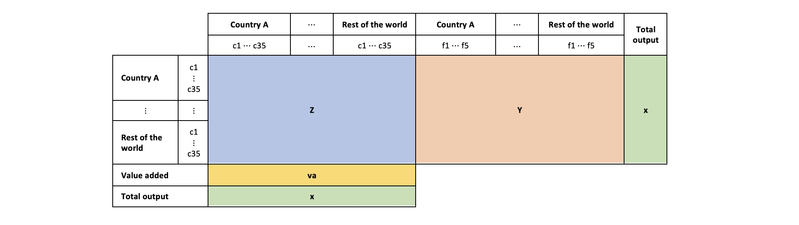

# ADB MRIO processing scripts

The Asian Development Bank (ADB) Multiregional Input–Output (MRIO) Tables are a time series of intercountry input–output tables disaggregated into 35 sectors. Final demand are disaggregated into five categories. The following is a schematic of an MRIO table.



Three versions of the tables are currently available:

1. **ADB MRIO 72 countries.** Available for 2017–2022.
1. **ADB MRIO 62 countries.** Available for 2000 and 2007–2022.
1. **ADB MRIO 62 countries constant price.** Values pegged to 2010 prices. Available for 2007–2022.

## Scripts

The scripts in this repo process the Excel files and implement various indicators from the input–output and global value chain literature. The following is a brief description of each notebook. Note that they must be run in order. All outputs are saved in parquet format.

| Notebook | Description |
| -------- | ----------- |
| **Preprocessing**<br>[`01-preprocess-mrios.ipynb`](codes/01-preprocess-mrios.ipynb)| Converts raw Excel files into machine-readable format. |
| **Summary table**<br>[`02-summary-table.ipynb`](codes/02-summary-table.ipynb) | Tabulates key aggregates for each country-sector. |
| **Value added flows**<br>[`03-value-added-flows.ipynb`](codes/03-value-added-flows.ipynb) | Computes value added originating from and finally absorbed in each country-sector. |
| **Borin–Mancini decomposition**<br>[`04-trade-accounting.ipynb`](codes/04-trade-accounting.ipynb) | Performs the Borin and Mancini (2019) exports decomposition at the sector level. |
| **GVC participation**<br>[`05-gvc-participation.ipynb`](codes/05-gvc-participation.ipynb) | Computes the trade-based and production-based GVC participation rates as defined in ADB (2021). |
| **Production lengths**<br>[`06-production-lengths.ipynb`](codes/06-production-lengths.ipynb) | Computes production lengths following the methodology of Wang, Wei, Yu, and Zhu (2017). |
| **Revealed comparative advantage**<br>[`07-revealed-comparative-advantage.ipynb`](codes/07-revealed-comparative-advantage.ipynb) | Computes revealed comparative advantage indices as defined in ADB (2021). |
| **Regional concentration**<br>[`08-regional-concentration.ipynb`](codes/08-regional-concentration.ipynb) | Computes a measure of regional trade concentration inspired by Frankel (1997). |
| **Deflators**<br>[`09-preprocess-deflators.ipynb`](codes/09-preprocess-deflators.ipynb) | Converts raw Excel files into machine-readable format. |
| **Real effective exchange rate weights**<br>[`10-reer-weights.ipynb`](codes/10-reer-weights.ipynb) | Computes real effective exchange rate weights matrices using the Bems and Johnson (2017) and Patel, Wang, and Wei (2019) methodologies. |
| **Real effective exchange rate indices**<br>[`11-reer.ipynb`](codes/11-reer.ipynb) | Computes the weights matrix and the real effective exchange rate index using the Bems and Johnson (2017) and Patel, Wang, and Wei (2019) methodologies. |
|     |     |

## References

- Asian Development Bank. 2021. ["An analytical framework for studying global value chains."](https://www.adb.org/sites/default/files/publication/720461/ki2021.pdf) In *Key Indicators for Asia and the Pacific 2021*. Mandaluyong City, Philippines: Asian Development Bank.
- Rudolfs Bems and Robert C. Johnson, R. C. (2017). ["Demand for value added and value-added exchange rates."](https://doi.org/10.1257/mac.20150216) *American Economic Journal: Macroeconomics*, 9(4), 45–90.
- Alessandro Borin and Michele Mancini. 2019. [“Measuring what matters in global value chains and value-added trade.”](https://elibrary.worldbank.org/doi/abs/10.1596/1813-9450-8804) *Policy Research Working Paper No. 8804*.
- Jeffrey A. Frankel. 1997. *Regional Trading Blocs in the World Economic System*. Washington, DC: Peterson Institute for International Economics.
- Nikhil Patel, Zhi Wang, and Shang-Jin Wei, S. (2019). ["Global value chains and effective exchange rates at the country- sector level."](https://doi.org/10.1111/jmcb.12670) Journal of Money, Credit, and Banking, 51(1), 7–42.
- Zhi Wang, Shang-Jin Wei, Xinding Yu, and Kunfu Zhu. 2017a. [“Characterizing global value chains: production length and upstreamness.”](https://www.nber.org/papers/w23261) *NBER Working Paper No. 23261*.

## Citing

```bibtex
@misc{ksreyes2023adbmrioscripts,
    title = {{ADB MRIO processing scripts}},
    author = {{Kenneth S. Reyes}},
    url = {https://github.com/ksreyes/adb-mrio},
    year = {2023},
}
```

## Disclaimer

The contents of this repository are in no way endorsed by the Asian Development Bank or the authors of cited works. All errors are my own.